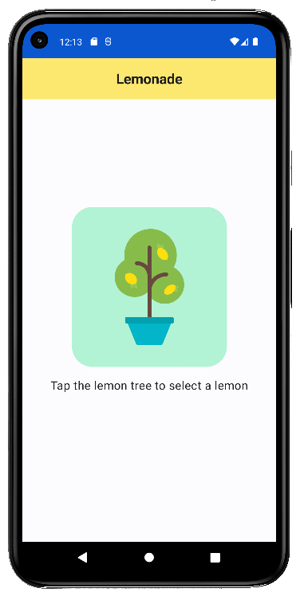
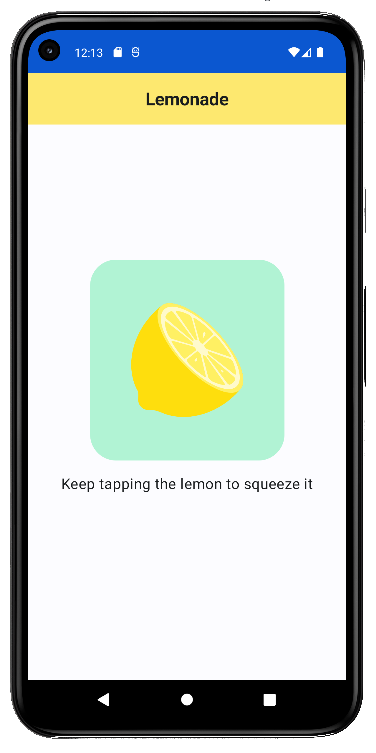
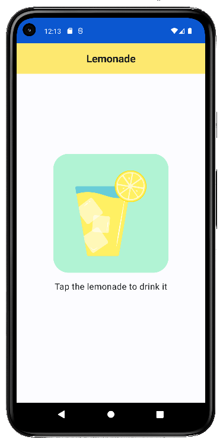
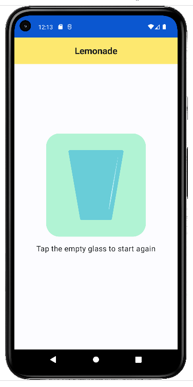

# Lemonade

Mini-Projet lié aux tutos proposés par la formation Google Developer Android
(code non identique à celui corrigé)
> chaque clic sur le bouton central affiche l'image suivante sauf pour le citron ou il faudra cliquer plusieurs fois

## Aperçu

